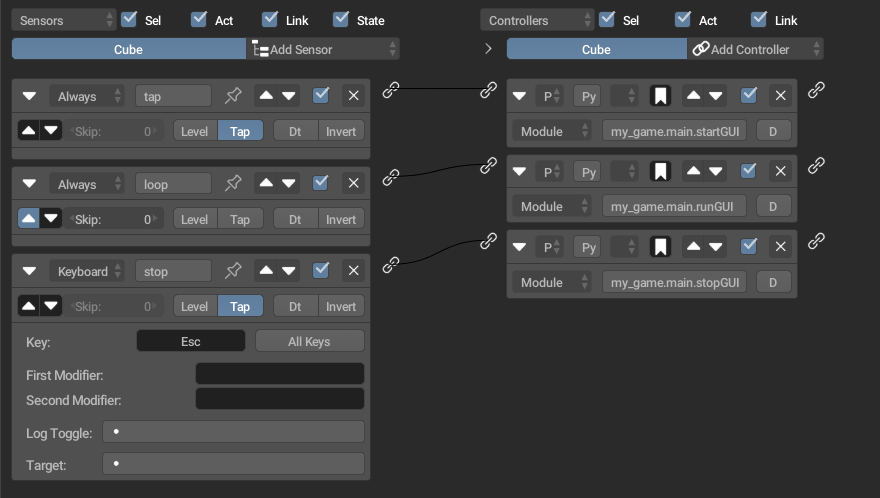

# bge-imgui
Integrate imgui_bundle with the Blender Game Engine (and variants)
Currently works with RanGE engine, UPBGE 0.2.5, and UPBGE 0.4+.

# Usage
To use in your game, simply add the my_game folder alongside your game blend. 
Not much documentation, but there are some comments in the python scripts
and some example files to help you.

> ⚠ NOTE FOR UPBGE USERS: If you are using the new Eevee-next renderer, in-game texture UI elements are not supported because the `bge.texture` module is broken. ⚠
> The new `gpu` module is the alternative, however it is feature-incomplete and lacks working documentation for rendering to textures. If you can find better documentation, please let me
> know and I can add a fix. **Full-screen UI elements still work fine in Eevee-next AFAIK**

To make a custom GUI for your game, extend BGEImguiWrapper class and 
override the setup_gui() and draw() methods. 
An example is shown in `my_gui.py`, and a usage example in `main.py`.

> If you just want a simple example for how to use imgui_bundle/pyimgui, refer to `simple.py`.

For both UPBGE and RanGE, the example's logic bricks look roughly like this:

But you can of course use Python Components or scripts however you want. 
By default, the BGEImguiWrapper stores the instance of itself in bge.logic.gui to make it easy to access from other scripts.

# Configuration
In order to set up `imgui_bundle` to work correctly in your game, there are a few steps involved.
First, you'll need to install `imgui_bundle` and a few other libraries into the engine's python install.
Here's a video guide: https://cdn.discordapp.com/attachments/481036916427325441/1189919082124943360/2023-12-28_08-10-18.mp4

Next, read `simple_gui.py` and `simple.py` to see how to make your own GUI class and run it in-game.

# Contribution
Simply make a pull request and/or add an issue for any bugs you find, I'm also active on the UPBGE discord as well as blenderartists.org
